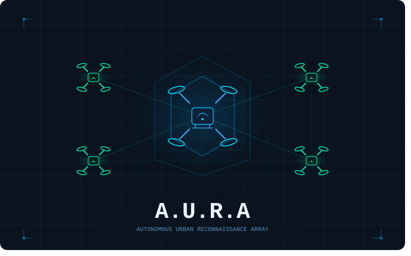

<p align="center">
  
</p>

# A.U.R.A — Autonomous Urban Reconnaissance Array

## Overview
**A.U.R.A** is a ROS 2-based drone swarm system designed for **post-earthquake disaster relief**. When terrestrial communication infrastructure collapses, A.U.R.A deploys a coordinated swarm of 5 UAVs that autonomously establish a WiFi mesh network, providing connectivity to civilians and first responders in the affected area.

The system integrates **Gazebo Classic** for multi-drone physics simulation, **PX4 SITL** for realistic autopilot behaviour, a custom **log-distance path loss network simulator**, and **reinforcement learning** (PPO) for intelligent swarm positioning — all orchestrated through **ROS 2 Humble**.

---

## Problem Statement
In disaster-affected areas, ground-based communication networks collapse — cell towers fall, fibre optics sever, power grids fail — leaving populations without the ability to call for help or coordinate rescues. The 2023 Turkey–Syria earthquake demonstrated that communication blackouts directly increase casualty rates by delaying search-and-rescue by hours or days.

There is a critical need for a **rapidly deployable, autonomous aerial communication mesh** that can self-organise, recover from failures, and sustain connectivity under harsh conditions.

---

## Project Goals

**Goal A — Emergency Coverage Bubble:** Deploy drones as aerial WiFi relay nodes enabling civilians to place VoIP/SOS calls, responders to coordinate operations, and critical data (GPS pings, photographs) to be uploaded to coordination teams.

**Goal B — Resilient Backhaul Connectivity:** Implement a high-altitude hub UAV as primary network gateway with adaptive backhaul routing and traffic buffering during complete infrastructure isolation.

**Goal C — Autonomous Swarm Coordination:** Develop AI-driven positioning algorithms that dynamically optimise network coverage through terrain-aware positioning, weather-responsive behaviour, and self-healing network topology.

---

## Docker Setup

### Prerequisites
- Ubuntu 22.04 host (or compatible Linux distribution)
- Docker Engine 24.0+
- NVIDIA GPU with driver 530+ and CUDA 12.0+
- NVIDIA Container Toolkit (`nvidia-docker2`)
- X11 display server (for Gazebo GUI)

### Building the Container

```bash
git clone https://github.com/YOUR_USERNAME/AURA.git
cd AURA
docker build -t aura:latest -f docker/Dockerfile .
```

### Running the Container

```bash
# Allow X11 forwarding for Gazebo GUI
xhost +local:docker

# Run with GPU support, display forwarding, and volume mounts
docker run -it --rm \
  --name aura \
  --gpus all \
  --privileged \
  --network host \
  -e DISPLAY=$DISPLAY \
  -e QT_X11_NO_MITSHM=1 \
  -v /tmp/.X11-unix:/tmp/.X11-unix:rw \
  -v $HOME/A.U.R.A/worlds:/home/aura/ws/worlds \
  -v $HOME/A.U.R.A/models:/home/aura/ws/models \
  -v $HOME/A.U.R.A/src:/home/aura/ws/src \
  aura:latest
```

### Container Contents

The Docker image includes:
- **Ubuntu 22.04** base with build essentials
- **ROS 2 Humble** (full desktop install)
- **Gazebo Classic 11** with plugins and model database
- **PX4 Autopilot v1.14** (pre-built SITL target)
- **Micro-XRCE-DDS Agent** for PX4 ↔ ROS 2 communication
- **PyTorch 2.x + CUDA** for RL training on GPU
- **Python packages**: gymnasium, numpy, scipy, fast_simplification
- **ROS Bridge Suite** for web dashboard connectivity
- **NS-3.40** (optional, for future high-fidelity network simulation)

### Volume Mounts

| Host Path | Container Path | Purpose |
|-----------|---------------|---------|
| `~/A.U.R.A/worlds` | `/home/aura/ws/worlds` | Gazebo world files and terrain models |
| `~/A.U.R.A/models` | `/home/aura/ws/models` | Trained RL policies and drone models |
| `~/A.U.R.A/src` | `/home/aura/ws/src` | ROS 2 package source code |

### First-Time Setup Inside Container

```bash
# Build all ROS 2 packages
cd ~/ws
colcon build
source install/setup.bash

# Set kernel parameters for multi-drone socket management
sudo sysctl -w net.ipv4.tcp_tw_reuse=1
sudo sysctl -w net.ipv4.tcp_fin_timeout=5

# Verify PX4 build
cd ~/PX4-Autopilot && make px4_sitl_default gazebo-classic
```

### Development Workflow

The recommended workflow uses **Zed editor on the host** with file sync to the container via volume mounts:

1. Edit source files on the host in `~/A.U.R.A/src/`
2. Changes appear instantly in the container at `/home/aura/ws/src/`
3. Build inside the container: `cd ~/ws && colcon build --packages-select <package>`
4. Run inside the container: `ros2 launch aura_simulation gazebo_swarm.launch.py`

---

## System Architecture

```
┌─────────────────────────────────────────────────────────────┐
│                    A.U.R.A Architecture                     │
├─────────────┬───────────────┬────────────────┬──────────────┤
│  Simulation │   Middleware  │  Intelligence  │  Monitoring  │
│             │               │                │              │
│ Gazebo 11   │ ROS 2 Humble  │ PPO Policy     │ Web Dashboard│
│ PX4 SITL    │ DDS-XRCE      │ HHO Baseline   │ ROS Bridge   │
│ iris x5     │ PX4 DDS Bridge│ Gym Environment│ Coverage Viz │
│ earthquake  │ Mission Ctrl  │ Network Sim    │              │
│ world       │               │ Coverage Calc  │              │
└─────────────┴───────────────┴────────────────┴──────────────┘
```

### ROS 2 Packages

| Package | Description |
|---------|-------------|
| `aura_simulation` | Launch files, PX4 DDS bridge, sim_params.yaml, earthquake disaster world |
| `aura_strategic_rl` | PPO policy, HHO baseline, Gymnasium training environment, training pipeline |
| `aura_network_sim` | Log-distance path loss model, BFS mesh routing, coverage mapping, visualization |
| `aura_mission_control` | Mission state machine: IDLE → PREFLIGHT → TAKEOFF → TRANSIT → OPERATIONS → RTL |
| `aura_msgs` | Custom ROS 2 message definitions (SwarmState, CoverageGoal, NetworkMetrics, etc.) |
| `aura_dashboard` | Web-based tactical dashboard via ROS Bridge WebSocket |

### Topic Graph

```
/swarm/state          ← PX4 DDS Bridge (drone positions, velocities, battery)
/network/metrics      ← Network Sim Node (coverage %, signal, throughput, latency)
/network/coverage_map ← Coverage Calculator (grid-based coverage data)
/coverage/goals       ← Strategic RL Node → PX4 DDS Bridge (position commands)
/mission/status       ← Mission Control (phase, alerts, drone counts)
/network/dead_zones   ← Dead Zone Publisher (signal attenuation regions)
/network/viz/*        ← Mesh Visualizer (RViz markers for drones, links, coverage)
```

---

## Disaster World

A custom Gazebo earthquake world (450m × 260m) containing:
- 12 collapsed houses, 7 collapsed industrial buildings
- 2 collapsed police stations, 1 school, 1 reactor
- 3 fallen radio towers (boundary markers), 2 water towers
- Simple Baylands terrain heightmap with roads and paths
- Launchpad at origin (0, 0) with H-marker

---

## Algorithms

### Reinforcement Learning (PPO)
- **Observation:** 184-dim vector (drone states, 10×10 coverage grid, network metrics, weather zones)
- **Action:** 15-dim continuous (dx, dy, dz per drone × 5 drones)
- **Reward:** Multi-objective combining coverage (weight 2.0), connectivity (weight 3.0), signal quality, proximity to disaster zone, and safety penalties
- **Architecture:** MLP actor-critic with LayerNorm and tanh-squashed Gaussian actions
- **Best result:** Reward 1971, 100% connectivity (5-drone dead-zone-aware policy, 1M steps)

### Baseline Controller (Hungarian + Circular Formation)
- Hungarian assignment algorithm for optimal drone-to-slot matching
- Circular formation centred on disaster zone (125, -164)
- Achieves 96–99% coverage with deterministic positioning
- Dead zone avoidance: pushes drones away from active attenuation zones

### Context-Dependent Policy Switching
- **Normal operations:** Baseline controller (reliable, immediate coverage)
- **Dead zone detected:** Auto-switches to dead-zone-aware RL policy
- **Manual toggle:** `ros2 service call /strategic_rl/toggle_mode std_srvs/srv/Trigger`
- Dashboard shows current mode in real-time ("BASELINE (HHO)" or "TRAINED POLICY")

---

## Quick Start

### Launch

**Terminal 1 — Simulation:**
```bash
~/ws/scripts/clean_sim.sh
sleep 15
source ~/ws/install/setup.bash
ros2 launch aura_simulation gazebo_swarm.launch.py num_drones:=5
```

**Terminal 2 — Controller (after drones reach OPERATIONS phase):**
```bash
source ~/ws/install/setup.bash
ros2 run aura_strategic_rl strategic_rl_node \
  --ros-args -p num_drones:=5 -p use_baseline:=true \
  --params-file ~/ws/install/aura_simulation/share/aura_simulation/config/sim_params.yaml
```

**Terminal 3 — Dashboard:**
```bash
source ~/ws/install/setup.bash
ros2 launch rosbridge_server rosbridge_websocket_launch.xml
# Open http://localhost:8080/aura_dashboard.html in browser
```

### Runtime Commands

```bash
# Inject a dead zone (triggers auto-switch to RL)
ros2 service call /dead_zone_publisher/add_random_zone std_srvs/srv/Trigger

# Clear all dead zones
ros2 service call /dead_zone_publisher/clear_zones std_srvs/srv/Trigger

# Toggle between baseline and RL manually
ros2 service call /strategic_rl/toggle_mode std_srvs/srv/Trigger

# Abort mission
ros2 topic pub /mission/command std_msgs/msg/String "data: 'abort'" --once
```

### Train RL Policy

```bash
cd ~/ws && source install/setup.bash

# Standard training (no dead zones)
python3 -m aura_strategic_rl.train_policy \
  --timesteps 500000 --num-envs 8 \
  --lr 5e-5 --ent-coef 0.0005 \
  --num-drones 5 \
  --save-path ~/ws/models/rl_5drones

# Training with dead zone awareness
python3 -m aura_strategic_rl.train_policy \
  --timesteps 1000000 --num-envs 8 \
  --lr 3e-5 --ent-coef 0.0005 --weather \
  --num-drones 5 \
  --save-path ~/ws/models/rl_5drones_deadzone
```

---

## Key Results

| Metric | Value |
|--------|-------|
| Drones supported | 4–5 simultaneous |
| Network coverage | 96–99% of disaster zone |
| Signal strength | -75.5 dBm average |
| Throughput | 114.7 Mbps aggregate |
| Latency | 6.0 ms average |
| Mesh links | 10 (fully connected) |
| Mission phases | 8 (IDLE through COMPLETE) |
| Simulation FPS | 60+ with 5 drones |

---

## Challenges Solved

- **Gazebo Classic duplicate Load() bug:** Static model-name registry prevents plugin re-initialisation on multi-drone spawn
- **PX4 multi-instance port conflicts:** Spawn-order reversal with port-ready verification before PX4 startup
- **NED/ENU coordinate mismatch:** Consistent conversion pipeline in PX4 DDS bridge (read: x_enu=y_ned; write: x_ned=y_enu)
- **RL reward collapse:** World-centred normalisation, connectivity weight increase (1→3), proximity reward gradient
- **Mission transit timeout:** Swarm centroid arrival check replacing per-drone radius check

---

## Future Work

- **MAPPO migration:** Centralised Training, Decentralised Execution for better scalability
- **Gazebo Harmonic:** Modern simulator eliminating Classic's plugin bugs
- **Hardware deployment:** Transfer to physical Pixhawk-based drones
- **NS-3 integration:** High-fidelity WiFi/LTE network simulation
- **Dynamic scenarios:** Moving civilians, aftershocks, weather evolution

---

## Research References

1. Zhou et al., "Swarm of micro flying robots in the wild," *Science Robotics*, vol. 7, eabm5954, 2022.
2. Heidari et al., "Harris hawks optimization: Algorithm and applications," *Future Generation Computer Systems*, 2019.
3. Li et al., "Neural network-based truck-drone collaborative delivery under adverse conditions," *Mathematics*, 2025.
4. Schulman et al., "Proximal Policy Optimization Algorithms," arXiv:1707.06347, 2017.
5. Sun et al., "Integrated Communication and Control for Energy-Efficient UAV Swarms," arXiv:2509.23905, 2025.

---

## Author
**Hussein Khadra (U224N1877)**
University of Nicosia — Department of Computer Science
Supervised by **Prof. Mavromoustakis**

## License
MIT License — open for academic and research collaboration.

---

> *A.U.R.A: Restoring connectivity when the ground network falls silent.*
